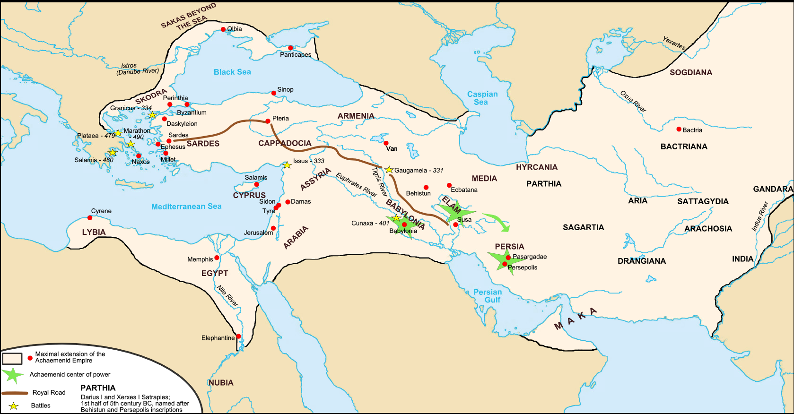

### 古代

#### 苏美尔文明/Sumer

##### 基本信息
* 年代
* 地理
    * 美索不达米亚，两河流域
* 政治形态
    * 城邦
* 宗教
    * 多神教/Polytheism
    * 他们崇拜许多的自然神灵，如天神（安努）、地神（恩利尔）、水神（奴恩）、太阳神（沙马什）、月神（辛）、女神（伊什塔尔）等。苏美尔宗教有一个令人值得注意的特点：它不主张有什么极乐的和永恒的后世，而更在乎于现世的生存。
* 阶级

##### 主要城市
* 乌尔/
* 埃利都/Eridu

##### 重要人物

##### 重要发明
* 文字
    楔形文字/cuneiform

#### 阿卡德帝国/Akkadian Empire
##### 基本信息
* 年代
* 地理
* 政治形态
* 宗教
* 阶级

##### 主要城市

##### 重要人物

##### 重要发明

#### 乌尔第三王朝
乌尔纳姆(Ur-Nammu)在约前2113年建立乌尔第三王朝，在位期间统一美索不达米亚南部诸城邦，建立起了强大的集权王朝

##### 基本信息
* 年代
* 地理
* 政治形态
* 宗教
* 阶级

##### 主要城市

##### 重要人物
* 乌尔纳姆/Ur-Nammu

##### 重要发明

#### 埃及/Egypt
##### 基本信息
* 年代
* 地理
* 政治形态
* 宗教
* 阶级

##### 主要城市

##### 重要人物

##### 重要发明

#### 巴比伦/Babylon

##### 基本信息
* 年代
* 地理
* 政治形态
* 宗教
* 阶级

##### 主要城市

##### 重要人物

##### 重要发明

#### 亚述/Neo-Assyrian Empire

##### 基本信息
* 年代
* 地理
* 政治形态
* 宗教
* 阶级

##### 主要城市

##### 重要人物

##### 重要发明

#### 以色列王国/Kingdom of Israel 

##### 基本信息
* 年代
* 地理
* 政治形态
* 宗教
* 阶级

##### 主要城市
* 耶路撒冷/Jerusalem

##### 重要人物

##### 重要发明

#### 波斯第一帝国/Achaemenid Empire

##### 基本信息
* 年代
* 地理
* 政治形态
* 宗教
* 阶级

##### 主要城市

##### 重要人物

##### 重要发明

##### 战争
* 希波战争

### 古典
#### 希腊
##### 基本信息
* 年代
* 地理
* 政治形态
* 宗教
* 阶级

##### 主要城市

##### 重要人物
* 希罗多的
* 苏格拉底
* 亚里士多德
* 柏拉图

##### 重要发明

#### 马其顿/亚历山大帝国/Macedonia 

##### 基本信息
* 年代
* 地理
* 政治形态
* 宗教
* 阶级

##### 主要城市

##### 重要人物
* 亚历山大

##### 重要发明

#### 罗马
##### 基本信息
* 年代
* 地理
* 政治形态
* 宗教
* 阶级

##### 主要城市

##### 重要人物
* 凯撒
* 屋大维
* 安东尼

##### 重要发明

#### 基督教兴起
##### 基本信息
* 年代
* 地理
* 政治形态
* 宗教
* 阶级

##### 主要城市

##### 重要人物

##### 重要发明

### 中世纪
#### 苏珊王朝
##### 基本信息
* 年代
* 地理
* 政治形态
* 宗教
* 阶级

##### 主要城市

##### 重要人物

##### 重要发明

#### 拜占庭
##### 基本信息
* 年代
* 地理
* 政治形态
* 宗教
* 阶级

##### 主要城市

##### 重要人物

##### 重要发明

#### 伊斯兰教兴起
##### 基本信息
* 年代
* 地理
* 政治形态
* 宗教
* 阶级

##### 主要城市

##### 重要人物

##### 重要发明

#### 倭马亚帝国
##### 基本信息
* 年代
* 地理
* 政治形态
* 宗教
* 阶级

##### 主要城市

##### 重要人物

##### 重要发明

#### 法兰克帝国
##### 基本信息
* 年代
* 地理
* 政治形态
* 宗教
* 阶级

##### 主要城市

##### 重要人物

##### 重要发明

#### 阿巴斯王朝
##### 基本信息
* 年代
* 地理
* 政治形态
* 宗教
* 阶级

##### 主要城市

##### 重要人物

##### 重要发明

#### 奥斯曼帝国
##### 基本信息
* 年代
* 地理
* 政治形态
* 宗教
* 阶级

##### 主要城市

##### 重要人物

##### 重要发明

### 种族
* 苏美尔人
* 闪米特人
    * 阿拉伯人
    * 犹太人
    * 希伯来人
* 埃及人
* 波斯人
* 希腊人

* 阿卡德人
* 巴比伦人
* 亚述人
* 赫梯人

### 地理
* 伊朗高原
* 新月沃地
* 叙利亚草原
* 地中海
* 东非大裂谷
* 阿拉伯半岛
* 阿拉伯沙漠

### 语系

